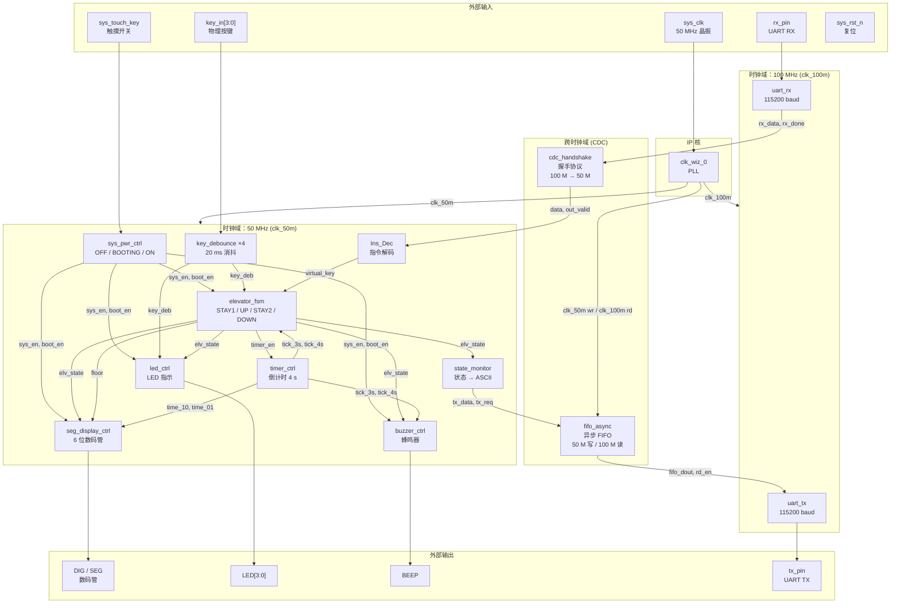

# 两层电梯控制器（FPGA）

## 项目功能简介

本项目基于 Xilinx Artix-7 FPGA（XC7A35T-2FGG484I）实现了一个两层电梯控制系统。系统以触摸键控制开关机（含1秒开机动画），通过4路物理按键或 UART 串口指令（ASCII `'1'`/`'2'`）双渠道发送楼层请求，电梯状态机在 STAY1（停1楼）、UP（上行）、STAY2（停2楼）、DOWN（下行）四态间切换；上行/下行过程持续4秒，3秒时数码管楼层数切换，4秒到达时蜂鸣器响0.5秒。实时状态通过6位数码管（楼层 + 倒计时）、4个LED（按键请求记录）和蜂鸣器同步反馈。系统采用双时钟域设计：50 MHz 域负责控制逻辑（FSM、计时、显示、按键消抖），100 MHz 域负责 UART 通信；两域间以异步 FIFO（状态上报，50 MHz 写 → 100 MHz 读）和握手协议（UART 接收，100 MHz → 50 MHz）安全交互，并集成 ILA 逻辑分析仪核辅助在板调试。

---

## 系统框图

> 以下为 Mermaid 源码，渲染结果见 `img/system_diagram.png`

---

## 各模块说明

| 模块名 | 源文件 | 功能描述 |
|---|---|---|
| `elevator_top` | `top_ladder.v` | 顶层模块，实例化并连接所有子模块 |
| `sys_pwr_ctrl` | `ctrl.v` | 系统电源 FSM（OFF / BOOTING / ON），触摸键边沿捕获，1 秒开机计时 |
| `elevator_fsm` | `elevator_fsm.v` | 电梯主状态机（STAY1 / UP / STAY2 / DOWN），管理上行/下行请求队列及楼层切换 |
| `timer_ctrl` | `count_4s.v` | 以0.1秒为单位倒计时，产生 `tick_3s`（3秒）、`tick_4s`（4秒）脉冲 |
| `key_debounce` | `key_debounce.v` | 20 ms 消抖，采用三级寄存器同步 + 计数器稳定检测，4路并行实例化 |
| `seg_display_ctrl` | `dynamic_led.v` | 6位数码管动态扫描（1 ms/位），显示楼层、运行状态和倒计时 |
| `led_ctrl` | `led.v` | 按楼层请求及当前 FSM 状态点亮对应 LED |
| `buzzer_ctrl` | `beep.v` | 到达目标楼层（`tick_4s`）时使蜂鸣器鸣响 0.5 秒 |
| `state_monitor` | `state_monitor.v` | 检测 FSM 状态跳变，将新状态编码为 ASCII 字符并发送写请求至 FIFO |
| `fifo_async` | IP 核 | 异步 FIFO，解耦 50 MHz 写（状态上报）与 100 MHz 读（UART 发送） |
| `uart_tx` | `uart_tx.v` | UART 发送模块，115200 baud，运行于 100 MHz，帧格式 8N1 |
| `uart_rx` | `uart_rx.v` | UART 接收模块，115200 baud，运行于 100 MHz，起始位中间采样 |
| `cdc_handshake` | `cdc_handshake.v` | 四相握手协议，将 100 MHz 接收的数据安全传递至 50 MHz 控制域 |
| `Ins_Dec` | `Ins_Dec.v` | 指令解码：ASCII `'1'`→ 上行虚拟按键，`'2'` → 下行虚拟按键 |
| `clk_wiz_0` | IP 核 | PLL 时钟生成，输入 50 MHz，输出 50 MHz（控制域）和 100 MHz（UART 域） |

---

## 仿真结果

### CDC 握手仿真（`cdc_handshake_tb.v`）

测试了单次传输、连续传输、并发请求（应忽略第二个 req 中的数据）、复位后重传共4组用例，全部通过（PASS=5，FAIL=0）。

**仿真波形**

**Tcl Console 输出**

---

### 电梯 FSM 仿真（`elevator_fsm_tb.v`）

验证了上行请求触发、`tick_3s` 楼层切换、`tick_4s` 状态转换、下行过程及复位功能，共9个断言全部通过（PASS=9，FAIL=0）。

**仿真波形**

**Tcl Console 输出**

---

## 上板演示

---

## 开发环境

| 项目 | 说明 |
|---|---|
| EDA 工具 | Vivado 2019.2 |
| FPGA 芯片 | Xilinx Artix-7 XC7A35T-2FGG484I |
| 输入时钟 | 50 MHz |
| UART 波特率 | 115200 baud，8N1 |
